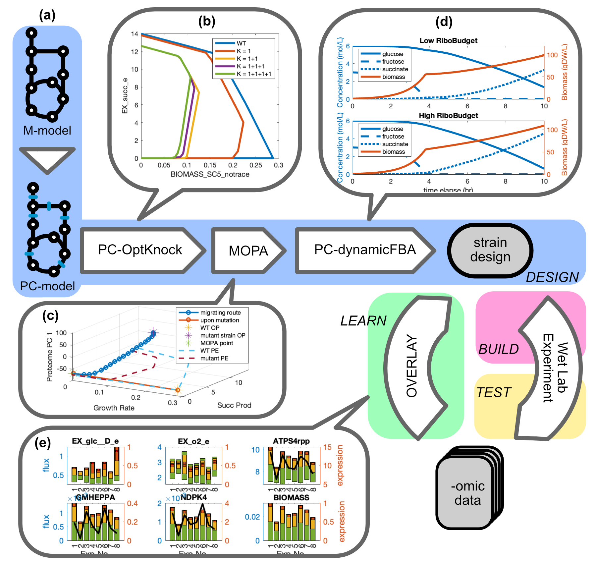

<a name="readme-top"></a>

<!-- PROJECT LOGO -->

<br />
<div align="center">

  <h3 align="center">PROSO Toolbox</h3>

  <p align="center">
    A Computational Toolbox for Context-Specific Genome-Scale Modelling
    <br />
    <a href="https://github.com/QCSB/PROSO-Toolbox/wiki"><strong>Project Wiki »</strong></a>
    <br />
    <a href="https://github.com/QCSB/PROSO-Toolbox/issues"><strong>Report Issues »</strong></a>
    <br />
    <br />
    NOTE: Please always use and refer to <a href="https://github.com/QCSB/PROSO-Toolbox"><strong>QCSB Release</strong></a>
  </p>
</div>


<!-- TABLE OF CONTENTS -->
<details>
  <summary>Table of Contents</summary>
  <ol>
    <li>
      <a href="#about-proso">About PROSO</a>
    </li>
    <li>
      <a href="#getting-started">Getting Started</a>
      <ul>
        <li><a href="#prerequisites">Prerequisites</a></li>
        <li><a href="#installation">Installation</a></li>
      </ul>
    </li>
    <li><a href="#usage">Usage</a></li>
    <li><a href="#roadmap">Roadmap</a></li>
    <li><a href="#cite-proso">Cite PROSO</a></li>
    <li><a href="#license">License</a></li>
    <li><a href="#contact">Contact</a></li>
  </ol>
</details>


## About PROSO

PROSO Toolbox is a collection of functions used to process, interpret, and study cellular multi-omics data under the scope of genome-scale modelling (GEM).

<a href="https://github.com/QCSB/PROSO-Toolbox">
  
</a>

What PROSO Toolbox offers:
* Automatic implementing protein constraints to any genome-scale metabolic model (M-model)
* System-level enzymatic constant estimation
* Incorporating gene expression data onto GEM for context-specific modelling
* Suggesting synthetic biology strategies for biotechnology, infectious disease, cancer research, and more

More information on PROSO Toolbox's intuition, formulation, and execution is available in <a href=[algae-paper]>our publication</a>. 

<p align="right">(<a href="#readme-top">back to top</a>)</p>


## Getting Started

PROSO Toolbox can be setup easily as follows. 

### Prerequisites

This is an example of how to list things you need to use the software and how to install them.

* <a href="https://www.mathworks.com/products/matlab">MATLAB</a> (R2015a or later). Extra add-ons:
  * Bioinformatics Toolbox
  * Statistics and Machine Learning Toolbox
  * etc.

* <a href="https://opencobra.github.io/cobratoolbox/stable">COBRA Toolbox</a> 
  * Please refer to openCOBRA for details on installation and troubleshooting.

* An Optimization Solver. We only support: 
  * <a href="https://www.gurobi.com/solutions/gurobi-optimizer/">Gurobi Optimizer</a> (**Preferred**)
  * <a href="https://www.ibm.com/products/ilog-cplex-optimization-studio/cplex-optimizer/">IBM CPLEX Optimization Studio</a>

### Installation

1. Clone the current repo to your PC

2. In MATLAB command window, add PROSO directory to path
   ```matlab
   >> addpath("Path-to-PROSO-Folder")
   >> savepath
   ```

3. It's good to go

<p align="right">(<a href="#readme-top">back to top</a>)</p>


## Usage

Here we only demonstrate a simple PC-model construction from _Pseudomonas aeruginosa_ M-model. Despite not being context-specific by itself, PC-model is an 'upgraded' M-model and can serve important purposes in research. 

1. Prepare Data or find them under PROSO/tutorial. Make sure they are in path or in your working directory: 

    - _P. aeruginosa_ metabolic reconstruction iSD1509 (doi: https://doi.org/10.1101/2021.04.15.439930)

    - Download _P. aeruginosa_ protein sequence FASTA (.faa): <a href="https://www.pseudomonas.com/downloads/pseudomonas/pgd_r_21_1/Pseudomonas_aeruginosa_UCBPP-PA14_109/Pseudomonas_aeruginosa_UCBPP-PA14_109.faa.gz">Pseudomonas Genome DB</a>
        
2. Construct draft PC-model from M-model

    - Open MATLAB, make sure all installations are done correctly. Initialize Cobra Toolbox and change the default solver to Gurobi (or IBM CPLEX). 

        ```matlab
        >> initCobraToolbox(false);
        >> changeCobraSolver('gurobi','all',0);
        ```
    
    - Construct the draft PC-model
    
        We are implementing protein constraints onto iSD1509, with a protein budget of 150mg/gDW. 
        
        ```matlab
        >> model_ori = readCbModel('iSD1509.xml');
        >> [model_pc_draft,fullProtein,fullCplx,C_matrix,K_matrix,proteinMM] = pcModel(model_ori,'Pseudomonas_aeruginosa_UCBPP-PA14_109.faa',150);
        ```

        This will take several minutes to complete.

        The M-model has 1510 genes (with one dummy gene), 1642 metabolites, and 2023 reactions.

        Note that the resulting draft PC-model has 7519 'metabolites' (1642 true metabolites + 1510 proteins + 1250 complexes + 1558 forward enzymes + 1558 reverse enzymes + proteinWC) and 12487 'reactions' (2023 true reactions + 1510 protein dilutions + 1250 complex formations + 4588 enzyme formations + 3116 enzyme dilutions). This structure will not be changed during tuning, only the coefficient will be modified. 
        
3. Tune the draft PC-model for better performance
    
    - Manually adjust protein complex stoichiometry
    
        This step is usually conducted using some database. For example, from <a href="https://biocyc.org/PAER208963/organism-summary">MetaCyc PA14 database</a> we can extract complex information to curate the draft PC-model. It is important for the user to appropriately appreciate the accuracy of each source, as almost nothing is guaranteed completely accurate.

        ATP synthase complex is a large protein complex with 9 subunits. Use surfNet to inspect it in PC-model:
        
        ```matlab
        >> surfNet(model_pc_draft,'cplxForm_x(193)x(197)x(195)x(198)x(200)x(199)x(196)x(194)x(192)');
        ```
        
        You can use keep track of complex -> enzyme -> reaction to make sure it is the ATPS complex, or going in reverse direction to find complexes for a certain reaction. 

        **For example**, If I want to change it so each one of ATPS complex has two copies of subunit alpha (atpA, PA14_73260), I first need to locate both complex and protein in their respective list:
        
        ```matlab
        >> pIdx = find(strcmp(fullProtein,'PA14_73260'));
        >> cIdx = find(C_matrix(pIdx,:));
        ```
        
        The change to make is protein #193 and complex #178. I change the coefficient from 1 to 2:
        
        ```matlab
        >> C_matrix(pIdx,cIdx) = 2;
        ```
        
        I want to finish all subunit modifications before proceed to next step.
    
    - Estimate enzymatic rate constants using SASA

        Now we have modified all protein complexes (C_matrix), their rate constants can be automatically estimated as below.

        ```matlab
        >> K_matrix = estimateKeffFromMW(C_matrix,K_matrix,proteinMM);
        ```

        This gives us an updated kinetic matrix to implement.
    
    - Update PC-model

        Implement new C_matrix and K_matrix back to PC-model.
        ```matlab
        >> model_pc = adjustStoichAndKeff(model_pc_draft,C_matrix,K_matrix);
        ```
        This will take some time to complete. 
    
4. What does PC-model does

    PC-model 'soft-cap' the system-level activity by constraining the total amount of proteins in the system. 
    
    ```matlab
    >> FBAsol = optimizeCbModel(model_ori,'max');
    >> FBAsol_pc = optimizeCbModel(model_pc,'max');
    ```
    
    The optimal growth rate of PC-model (FBAsol_pc.v) is smaller than the one of M-model (FBAsol.v). In general, PC-FBA better resembles organism's true exponential phase metabolism. 

_These are only the most basic functions. For more examples, please refer to the [Project wiki](https://github.com/QCSB/PROSO-Toolbox/wiki)_

<p align="right">(<a href="#readme-top">back to top</a>)</p>


## Roadmap

PROSO is a on-going project with future plans to refine and expand the scope.

- [ ] **Version 1.0**
    - [x] Automated PC-model Construction from M-model
    - [x] Convex QP for expression data incorporation
    - [x] Nonconvex QP for kinetic parameter estimation
    - [x] Debottlenecking algorithm
    - [ ] Finishing README, wiki, license, etc.

- [ ] **Version 2.0**
    - [ ] Implementing more mechanistic details
    - [ ] Allowing incorporation of other omics data
    - [ ] Other approach for kinetic parameter estimation

<!-- See the [open issues](https://github.com/othneildrew/Best-README-Template/issues) for a full list of proposed features (and known issues). -->

<p align="right">(<a href="#readme-top">back to top</a>)</p>


## Cite PROSO

Please cite our <a href=[algae-paper]>recent publication</a>

<p align="right">(<a href="#readme-top">back to top</a>)</p>


## License

work-in-progress

<!-- Distributed under the MIT License. See `LICENSE.txt` for more information. -->

<p align="right">(<a href="#readme-top">back to top</a>)</p>


## Contact

Herbert Yao - 16hy16@queensu.ca

<a href="https://biosyscompute.com/index">Queen's Computational Systems Biology Group</a>, Department of Chemical Engineering, Queen's University at Kingston, Canada


<p align="right">(<a href="#readme-top">back to top</a>)</p>


<!-- MARKDOWN LINKS & IMAGES -->
<!-- https://www.markdownguide.org/basic-syntax/#reference-style-links -->
[algae-paper]: https://doi.org/10.1101/2022.10.07.511370
[product-screenshot]: img/screenshot.png

